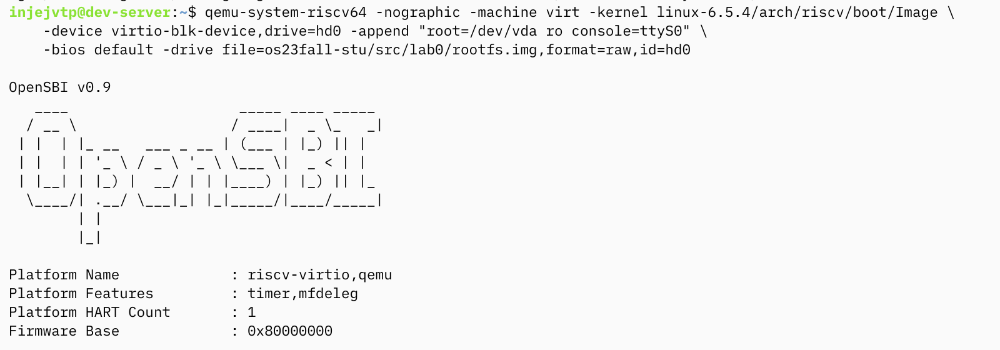
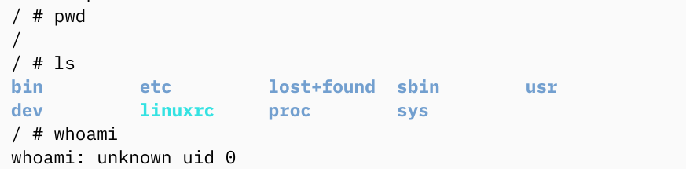
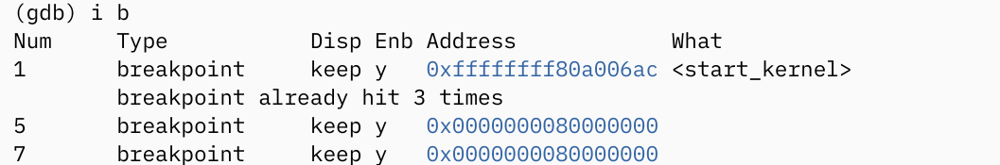
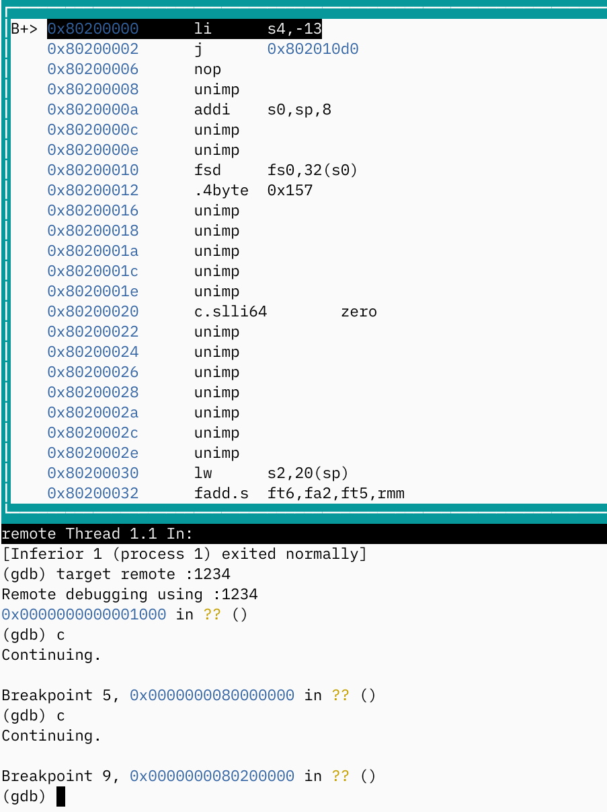
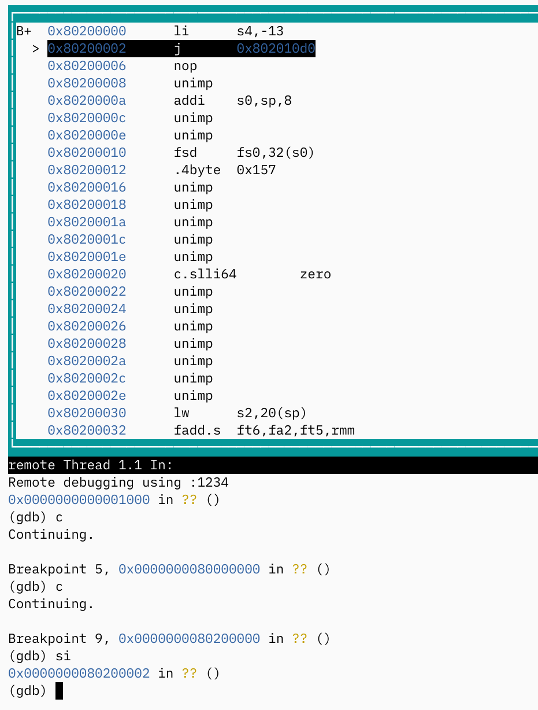
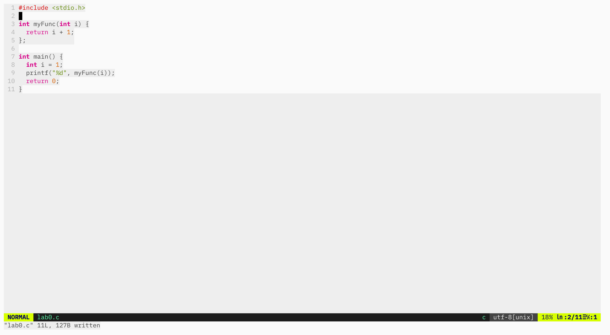
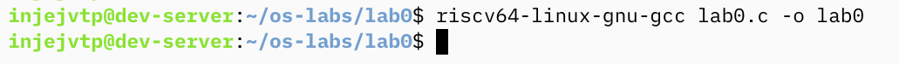
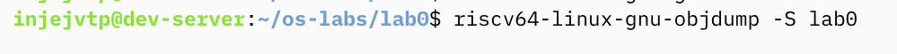
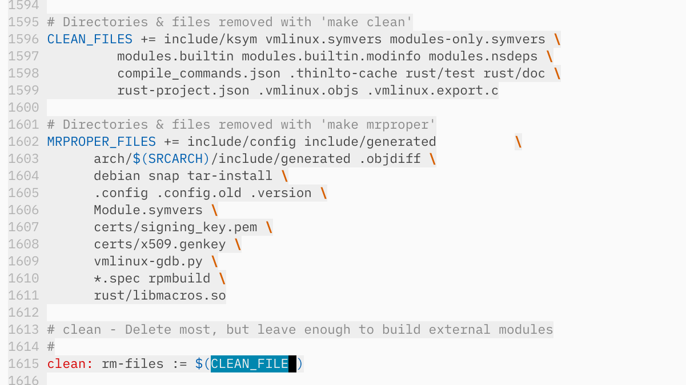

### 搭建实验环境

手上的 linux 设备性能比较拉跨，其他设备因为各种原因不是很方便，临时去 Google Cloud 租了一台，安装包的过程不赘述了，sudo apt update && sudo apt upgrade && sudo apt install ....

拉仓库和 make 的过程也不展示了

### 运行 qemu

看一下目录结构

运行 qemu

文档里没解释的：-append 用来给内核传递参数，root 挂载根文件系统，ro 表示只读模式运行，console 指定输出终端

稍微运行点命令看看

有一个不认识的 linuxrc

查了一下，busybox 是一个很多常用工具的集合，常用于嵌入式

### 调试

默认的内核编译是不带源码信息的，因此 layout source、step、info locals、display 这些命令无效。step instruction 即为执行一条指令，结合 layout asm 可以看到一条条往下执行。可以用 info functions 按顺序看一下函数然后加断点来快速执行。

展示以下思考题的第三部分：
在 0x80000000 下断点：

start_kernel 函数在 0x80200000 之后，重新启动一下内核，执行到断点：

单步执行：

### 交叉编译

lab0.c

编译

Dump

清除地看到 myFunc 定义和 main 的定义

### 其他

make clean 就略过了，一次全量编译还挺费时的……
作为替代找了一下 clean target 的位置

vmlinux 为最终编译出来的内核，但是无法直接启动，Image 为 vmlinux 经过剪切、压缩再加上一些 boot 用代码的产物
