### 完善 `head.S`

内容如图。这部分应该不需要额外说明。

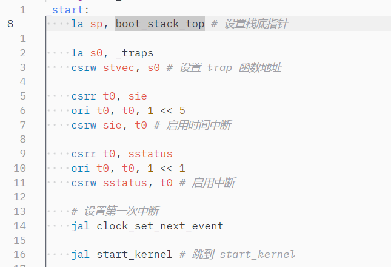

### Makefile

为 `.o`  添加源文件依赖即可。

### `sbi.c`、`defs.h`

按照格式编写内联汇编即可。

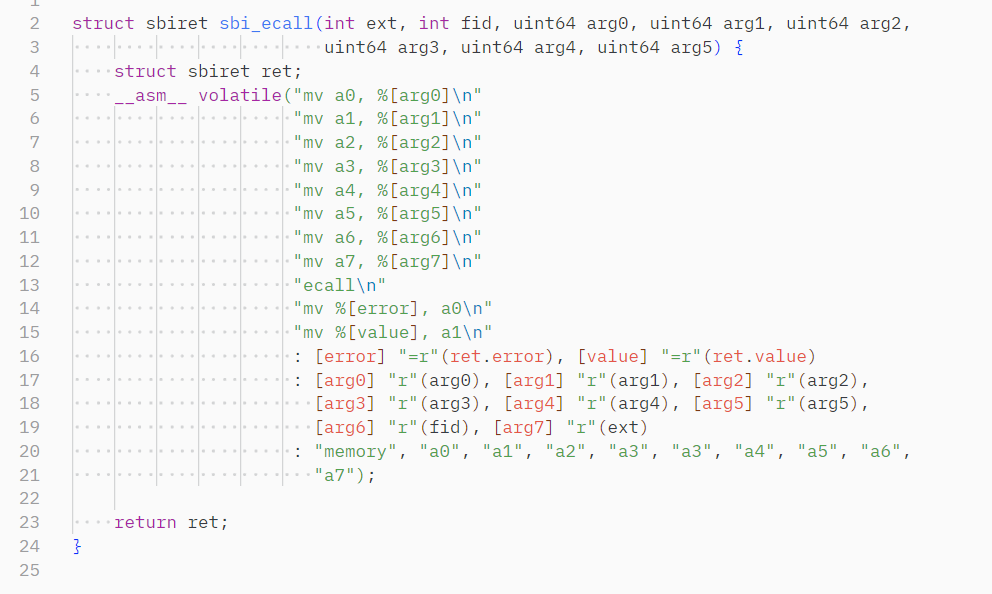

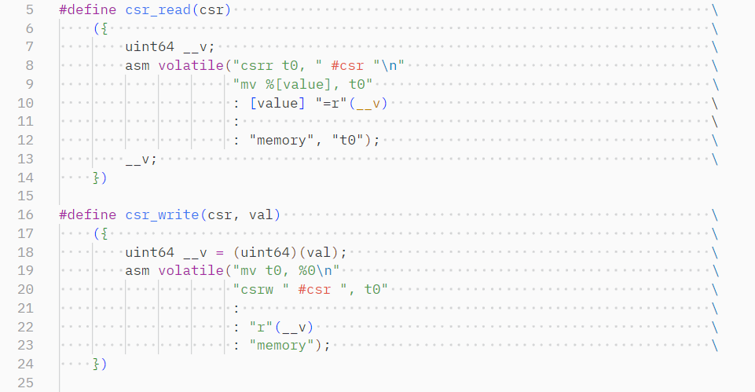

### 实现 `_traps`

保存 32 个寄存器。这里 sp 作为栈底指针，自然伸缩，不需要额外保存。中间函数调用 `trap_handler` 由编译器保证 callee save 的寄存器不会改变，因此这里其实没有必要保存 s 系列寄存器，只是写的时候从 x0 保存到 x31 都由 vim macro 直接生成，额外存一次也无妨。

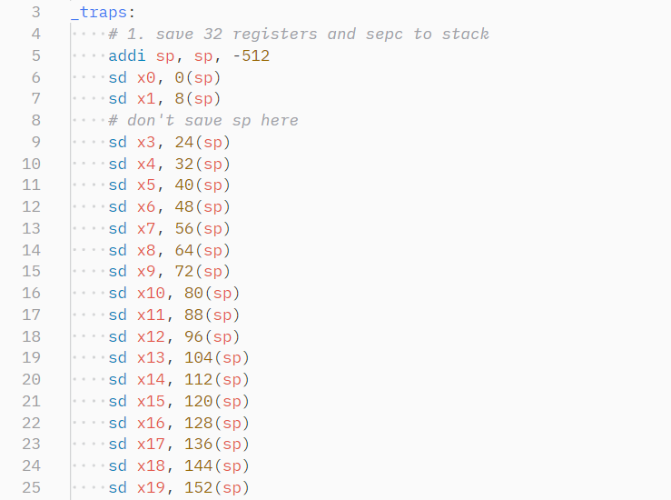

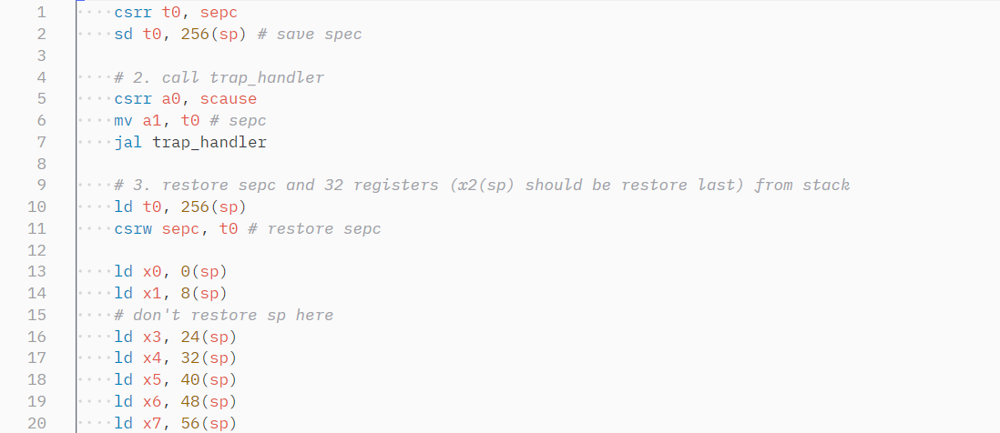


### 实现 `trap_handler`

处理中断。判断是否为 Interrupt & supervisor time interrupt 即可。在进入中断和结束中断时额外写了一次 sstatus 以保证处理中断时不接收新中断，实际上在整个实验中处理中断的时长都不可能超过一个时间片，因此该处理没什么实际作用。

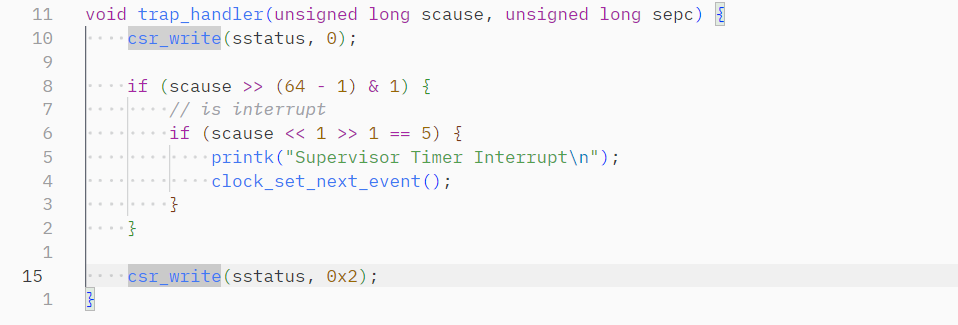

### 实现 clock 相关函数

逻辑也无需额外说明。

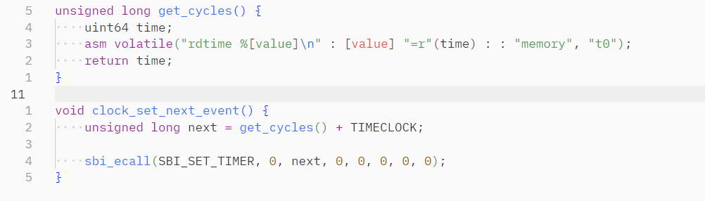

### 结果

正常输出。

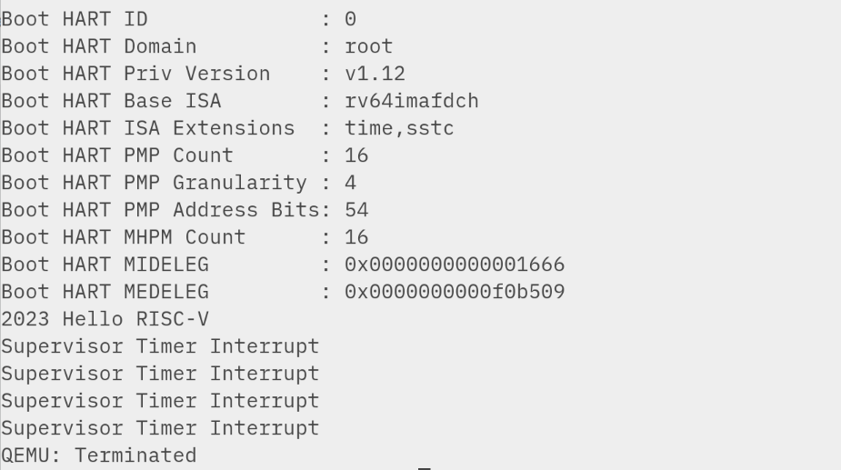

### 思考题

1. 入参优先使用 a0 - a7，不够时放入内存。返回值使用 a0 和 a1。callee save 的寄存器由被调用者保存，需要函数调用前后不变。caller save 则代表函数调用前后可能改变，如果 caller 需要这个寄存器的值需要自行保存。当然这只是 convention 而非 requisition，比如进程调度的函数执行前后肯定会发生改变。

2. 如图

   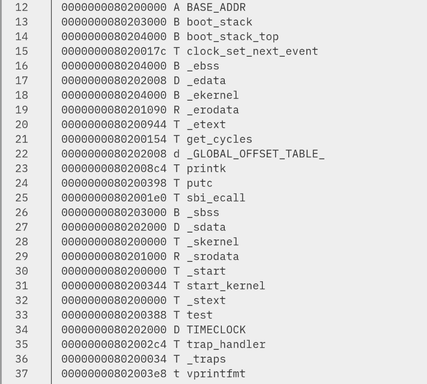

3. 思考题 3 和 4 一起写了。首先修改下源码：

   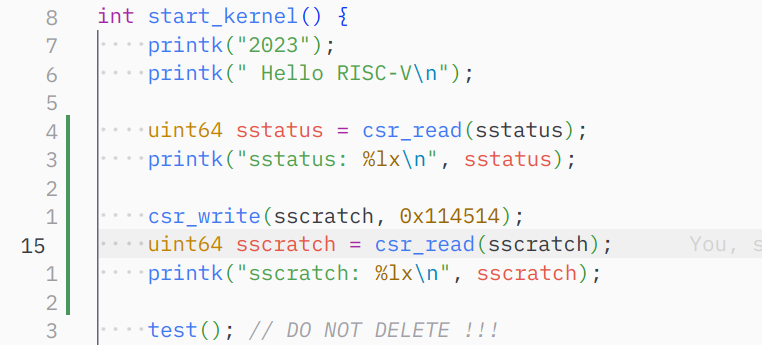

   运行结果：

   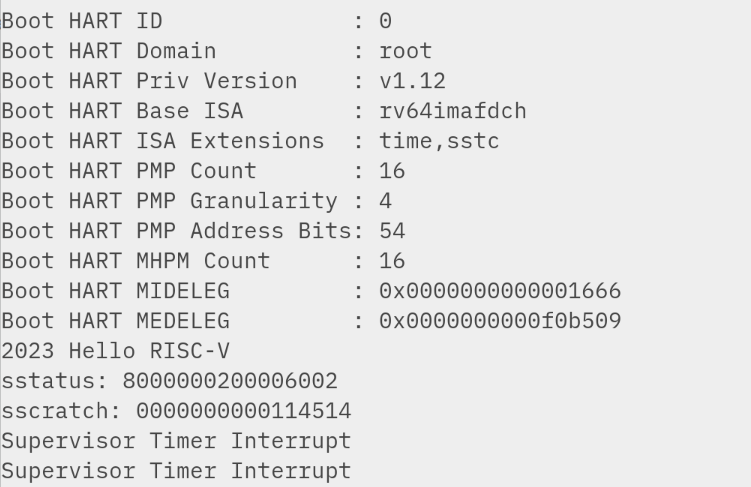

   sstatus 的第 1、13、14、33、63 位被置为了 1。

   第 1 位的值表示 SIE，是否开启中断。这里已经开启。

   第 13-14 位的值表示 FS，存储了浮点寄存器的状态，11 表示 dirty 状态。

   第 32-33 位的值表示 UXL，U-mode 下 XLEN（寄存器宽度） 的值。10 表示 64 位。

   第 63 位 SD 当且仅当 FS、XS、VS 三个值中有 Dirty 时被置为 1。这里 FS 为 Dirty。

5. 使用 arm64 配置并 make arch/arm64/kernel/sys.i

   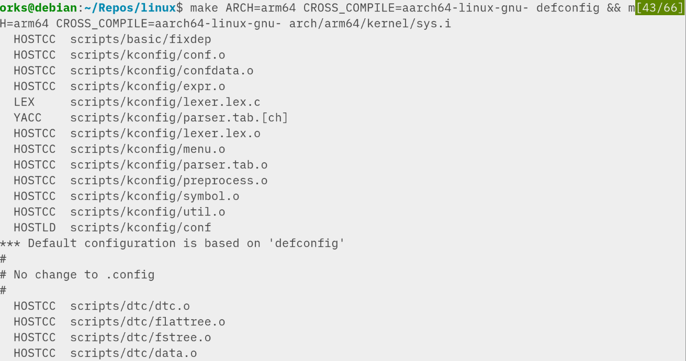

6. 在 arch 目录下搜索 syscall.tbl 文件

   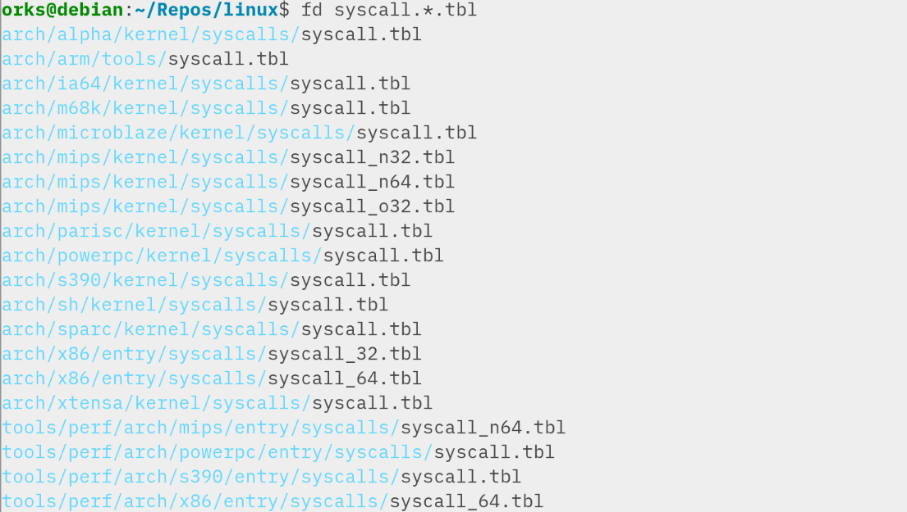

​	tbl 文件可以清楚地看到所有系统调用，虽然它们不直接参与编译。如：

​	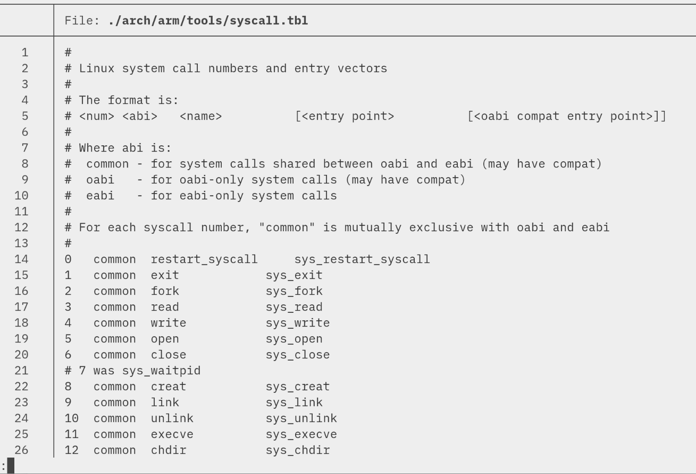

​	要找对应架构的 syscall 找出对应的文件即可。从实验指导中我看不出什么是“call table with macro expanded”，如果是指上面编译出的 sys.i，预处理后的文件确实展开了宏，但相比于上面的文件来说没什么可读性，甚至根据调用名找函数都比较困难。尝试编译了 syscall.i，情况也差不了太多；在对整个 linux kernel build 过程没什么概念的情况下，要看 syscall 最快的方法自然是 `man 2 <syscall>`

7. elf 是一种封装可执行/可链接二进制文件的格式。从链接器的角度看，elf 文件以 sections 为单位存储；从可执行的角度看，elf 文件以 segments 为单位存储。

   readelf 解析 elf 各个部分的信息（Metadata），objdump 则是对实际的二进制内容进行解析。比如，如下的 c 源码：

   ```c
   int add5(int num) {
       return num + 5;
   }
   ```

   编译为目标文件后，由于没有链接，各个段地址均为 0：

   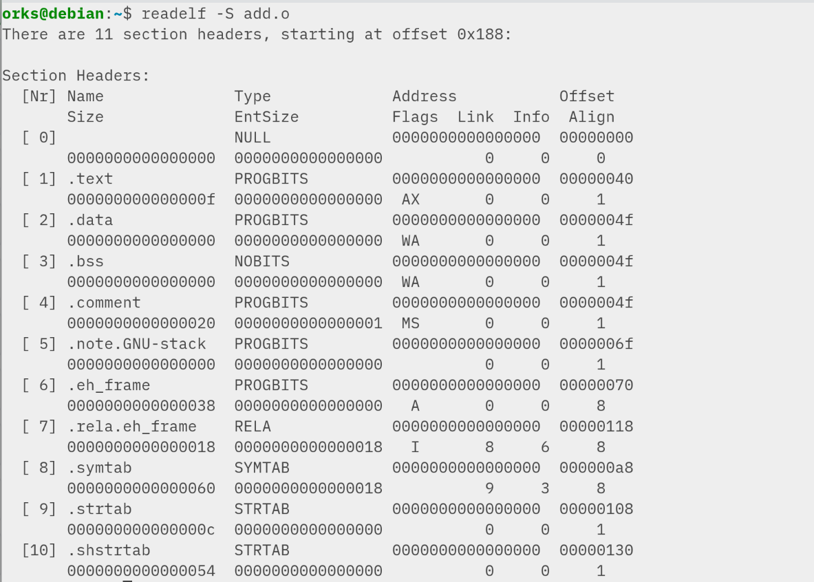

   用 objdump 反汇编：

   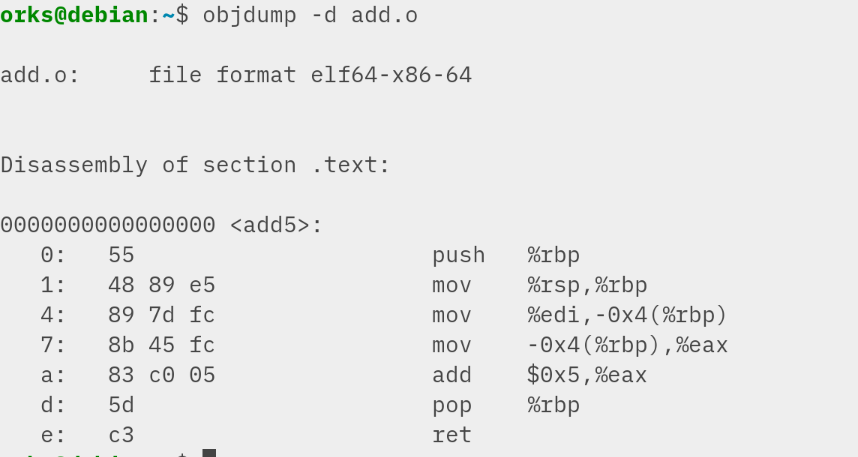

​	由于没有 main 函数，可以手动指定 entry 让唯一的函数作为入口：

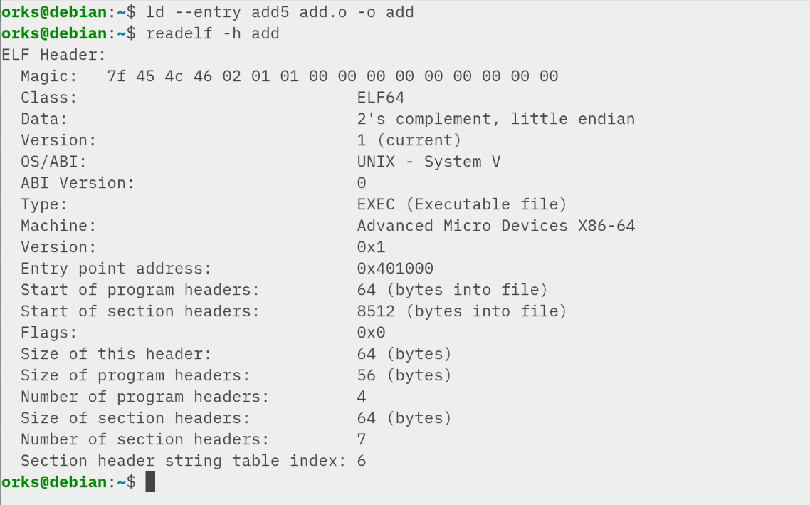

此时 entry 非零，正常链接。

简单写一个 sleep 一分钟的程序：

```c
#include <unistd.h>

int main() {
    sleep(60);
}
```

开始运行后 & 或者发送 ^Z 让其在后台运行，找出 pid，打印：

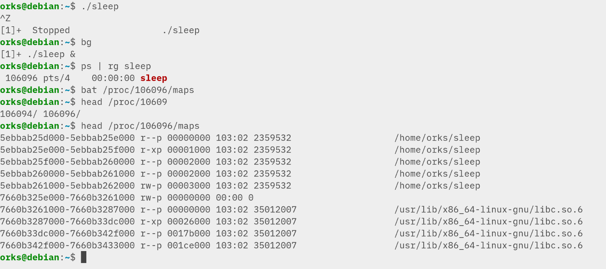

8. medeleg 表示该 Exception 在 S 模式下 handle，mideleg 表示该 Interrupt 在 S 模式下 handle。某一位置 1，表示该位（第几位）所对应的中断号由 M 模式委托给 S 模式处理。


​	我本地的 qemu 默认开启了 1（软件中断）、5（时间中断）、9（外部中断）等 Interruption，8（U mode ecall）、12、13、15（Page Fault）等 Exception。

### 讨论心得

lab1 是我全部 7 个实验中所花时间最长的一个。首先是 riscv ，x86 系列的 ebp + esp 调用规范和 riscv 的调用规范有诸多不同，编写了若干 demo 在 [godbolt](https://godbolt.org/) 上反复对照源码和汇编才逐渐熟悉。这部分大概花了两三天。

其次是 boot 过程，在硬件上从主板 ROM - bootloader - kernel 的过程，在 qemu 中被简化为“从 0x8020000” 处开始运行 kernel，背后的过程完全被隐藏，在这种情况下开始开发让我非常不安。大概也花了两天，深入了解了 BIOS 的 boot 流程，简单看了看 UEFI 的流程，才开始开发。有很多文章说 riscv 的 sbi 所做的工作不同，虽然我没有深入了解，但大体上肯定逃不过上电、初始化内存、初始化硬盘、初始化文件系统几个步骤。至于这中间它初始化了别的一些设备，带了什么驱动，都是现在不需要关心的细枝末节。

最后由于 gdb 未进行配置的原生状态实在是太不好用了，也大概花了一天多的时间折腾各种 gdb 前端或者社区的 gdbinit 配置。

把这三件事做完后在后续的实验过程中基本没有遇到大的难点，比较畅通无阻。

另外，不太清楚思考题 5&6 的意义。如果希望借此更加熟练 make 的使用，至少给出详细要做的事；如果希望提供一种查阅 syscall 的方式，比这更友好和清晰的方式有很多；如果希望提供一次“在 linux 内核源文件中寻找特定信息”的经历，这得至少花上一整个实验的时间才能多少熟悉一些它的结构。