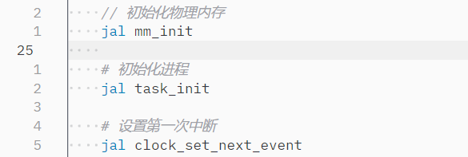
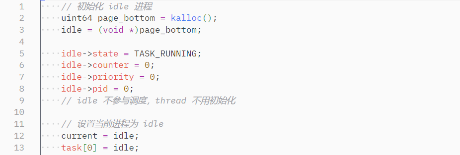
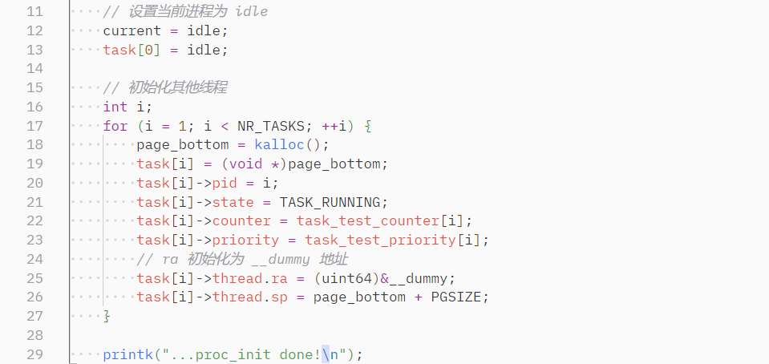
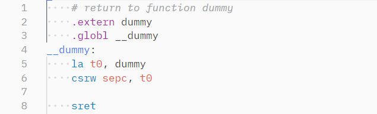

### 修改 `head.S`

在第一次中断前，初始化内存和进程：

### 实现 `task_init`

首先初始化 idle 进程。idle 进程不参与调度，因此分配一个内核栈，pid 置 0 即可，其他属性无所谓。最后把 current 置为 idle。

初始化其他进程。分配内核栈、pid、counter 和 priority，最后将 ra 指向 __dummy，sp 指向栈顶。

### 实现 `__dummy`

跳转至 dummy 函数，无需其他动作。

### 实现 `switch_to` 和 `__swtich_to`

