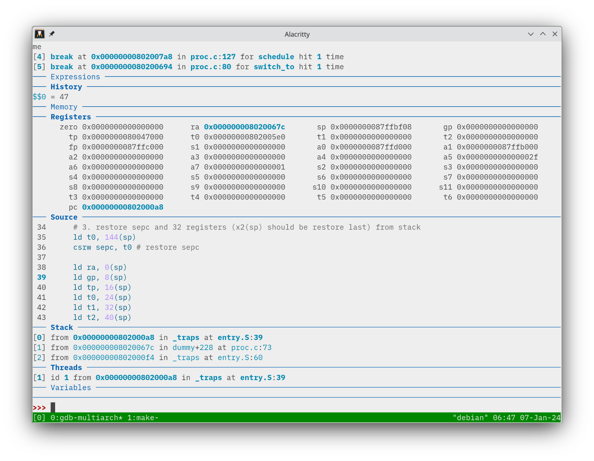

### 修改 `head.S`

在第一次中断前，初始化内存和进程：

### 实现 `task_init`

首先初始化 idle 进程。idle 进程不参与调度，因此分配一个内核栈，pid 置 0 即可，其他属性无所谓。最后把 current 置为 idle。

初始化其他进程。分配内核栈、pid、counter 和 priority，最后将 ra 指向 __dummy，sp 指向栈顶。

### 实现 `__dummy`

跳转至 dummy 函数，无需其他动作。

### 实现 `switch_to` 和 `__swtich_to`

switch_to 跳转至 next，同时修改 current

__switch_to 切换上下文，a0 为传入的 prev，a1 为 next

### 实现调度算法

短作业优先：找出所需时间最短进行调度。全部调度完一遍后 counter 用 rand 赋值。

优先级算法：找出所需时间最长（优先级最高）的进行调度。全部调度完一遍后 counter 用 priority 赋值。

### 结果

Priority：

SJF：

### 思考题

1. 保存寄存器的目的是中断前后寄存器内部不变。如果在进入中断时保存 caller save 的寄存器，接下来只需要保证 callee save 的寄存器不变即可。从 _traps 进入后直到 __switch_to 之前都是正常函数调用，无需担心过程中的 callee save 寄存器改变。

   但只在此处全部保存 32 个寄存器是不可能的，因为在先前的执行过程中，caller save 的寄存器已经永久丢失。

2. ra 在进入 _traps 后，首先保存在栈中，进入 trap_handler 后 ra 被写为 jal 指令的下一行。trap_handler 中调用 do_timer，ra 先被存入栈，再被写为下一行。do_timer 中调用 schedule，ra 先被存入栈，再被写为下一行。schedule 中调用 __schedule，ra 先被存入栈，再被写为下一行。随后 ra 从另一个调度进程中被恢复，正常进程同样是走过上面所有流程，因此这里 ret 返回到 schedule 函数，再返回到 do_timer 函数，再返回到 trap_handler 函数，从栈中恢复进程实际 ra。

   总计被写入 4 次，恢复 4 次。以下是 8 张图。

   

   

   

   

   

   

   开始恢复

   

至此，ra 恢复为 0x8020067c，完成一次调度。

### 讨论心得

这里首次出现了中断与上下文切换中可能出现部分寄存器被存入/恢复两次的问题，并且可能覆盖的问题。同时由于上下文切换的增加使得 trap_handler 不再是一个常规的“函数”，caller save 和 callee save 不一定适用。

这里我采用的方式是，将一个进程时间片耗尽的最后一次中断到新一轮重新调度到该进程视为一个完整中断，进而可以正常将寄存器分类，删去中断后保存的 s 系列寄存器。

这种思维模式有一个问题，就是每个进程第一次被调度时没有相应的进入中断过程，因此需要额外考虑。这里的 `__dummy` 函数正好发挥了作用。但在后面的用户程序再一次遇到了这个问题，此为后话不提。
