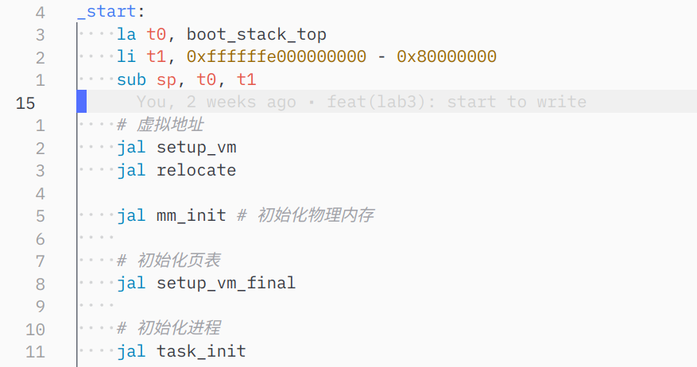
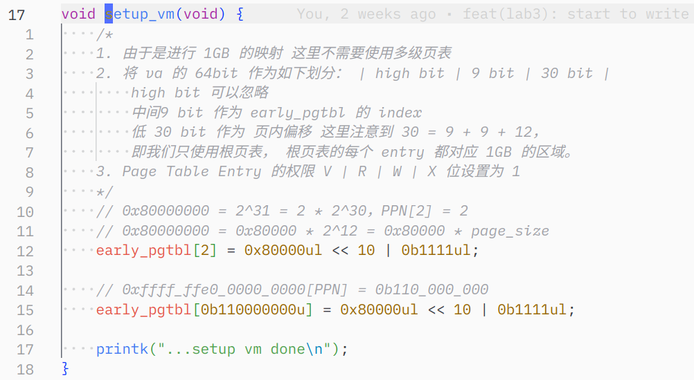
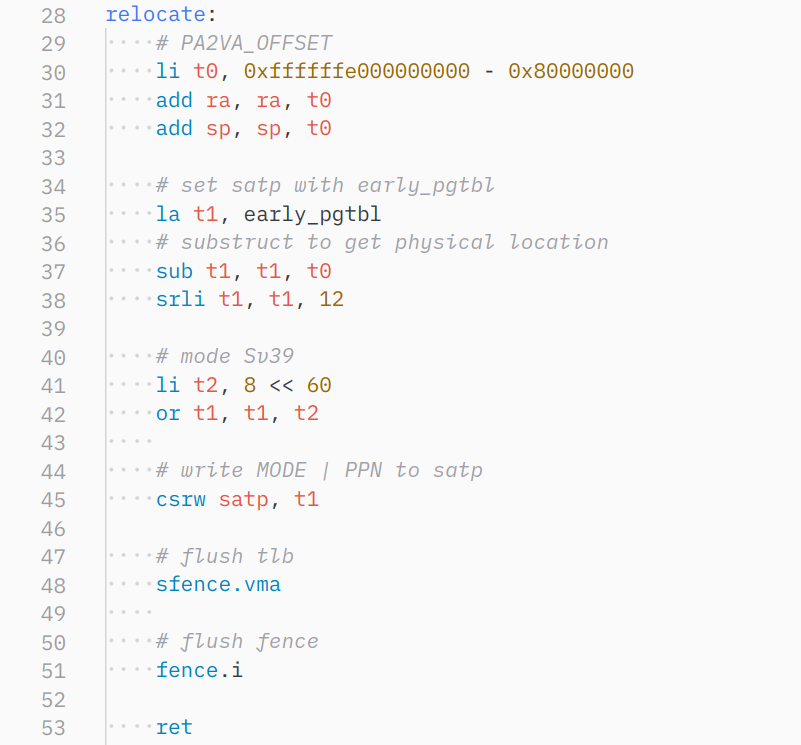
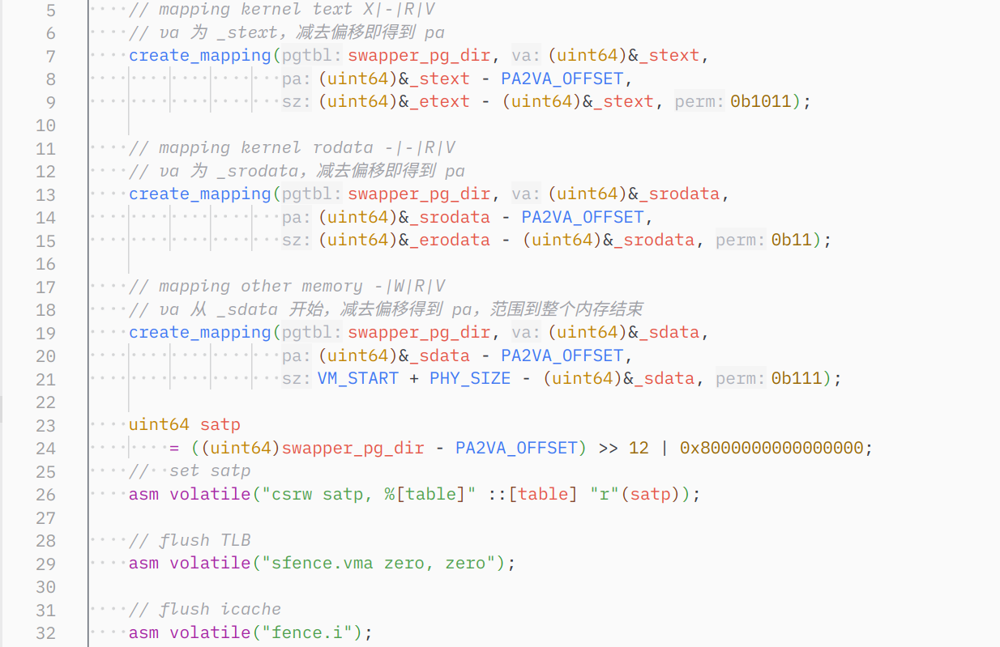
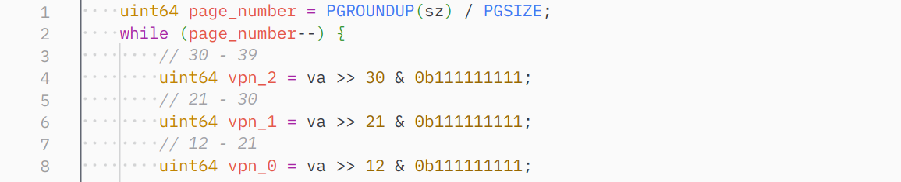
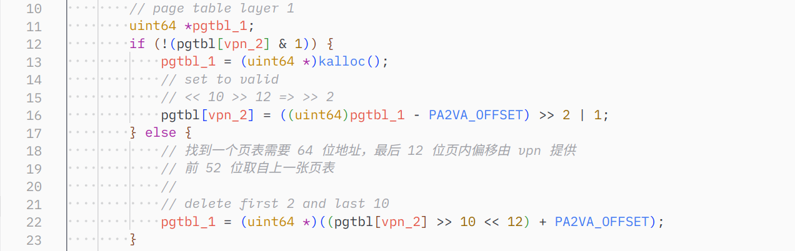
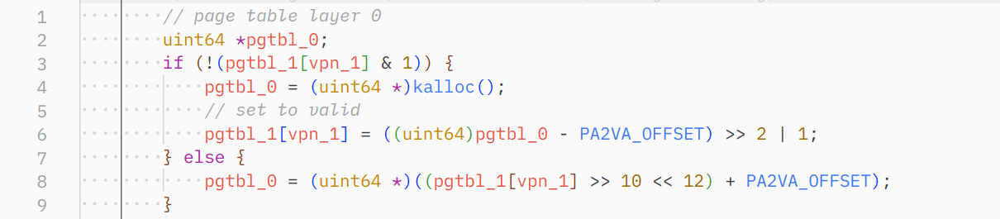
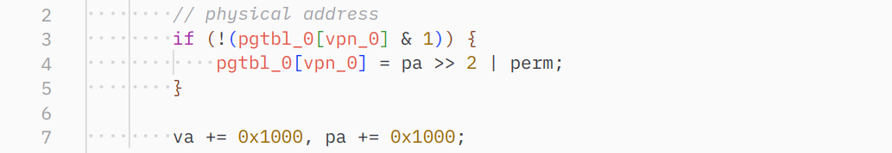
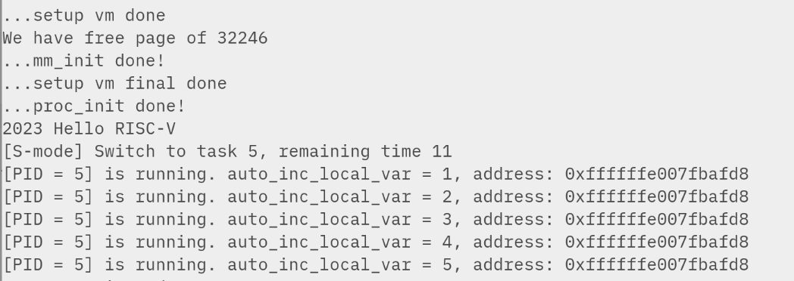
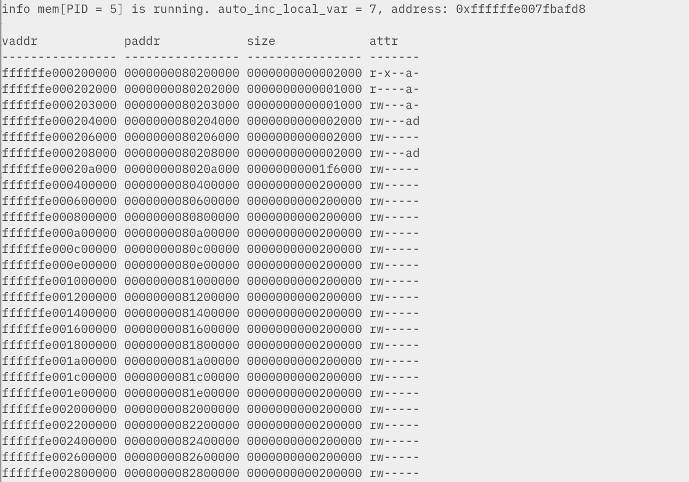

### 修改 `head.S`

在适当的地方调用 `setup_vm`、`relocate` 和 `setup_vm_final`，同时修改设置内核栈，将其改为真实地址。

### 实现 `setup_vm`

进行两次映射，分别是实际的物理地址和内核虚拟地址的映射。这里使用 early_pgtbl 页表，具体的计算过程已经在注释中说明。将两个地址对应的 PTE 计算一下即可。

### 实现 `relocate`

该函数只做了一件事，写入 satp。取 early_pgtbl 的地址后进行一番地址后写入即可。最后刷新 tlb。

### 实现 `setup_vm_final`

这里创建实际用的页表。和 early_pgtbl 的区别是，这里对不同的代码段进行不同权限的映射，并且使用三级映射，只把用到的内存部分进行映射。

最后部分过程和 relocate 一模一样。这里可以用 c 写的原因是不需要修改 ra/sp 寄存器，这两个寄存器的保存/恢复过程很大程度上是由编译器 handle 的，不太方便干预。

具体怎么 mapping 的看注释。

### 实现 `create_mapping`

不出意外这是全部实验中最复杂的函数，原因是涉及到大量精细的位运算并且**极难排查问题**。

首先计算需要 map 的页数，循环，并计算每页的三个页号：

第二级页表在编译时创建，直接来看第一级页表是否存在，不存在创建并计算 pte，存在则从 pte 反计算出页表地址：

对零级页表重复操作：

最后填入实际的物理地址：

### 结果

### 思考题

1. 在 qemu 控制台中执行 info mem 查看当前映射状态。适用于 riscv，不一定适用其他架构：

   

​	符合预期。由于 tty 持续的输出导致提示符看不清，这不是关键。

2. `csrw satp` 执行完后 pc 仍然指向物理地址。
3. 目标是让开启虚拟地址后，正常往下执行。这有若干种方案，假如我们不希望在 `setup_vm` 中做映射，一种取巧方案是直接在源代码中硬编码 early_pgtbl；当然这没什么本质区别。或者 handle `Instruction Page Fault`，把 ra、sp、sepc 等寄存器计算一下偏移，正常返回去执行。

### 讨论心得

本实验最大的难点前面已经提到，即实现 `create_mapping` 函数。运气好的是当时在社交媒体上吐槽 gdb 之难用时有网友（居然还是内核开发者……）指出 qemu 的控制台可以打印内存映射信息，给调试帮了大忙，有没有成功映射一看便知。特别鸣谢 @Ziyao233 的帮忙。
