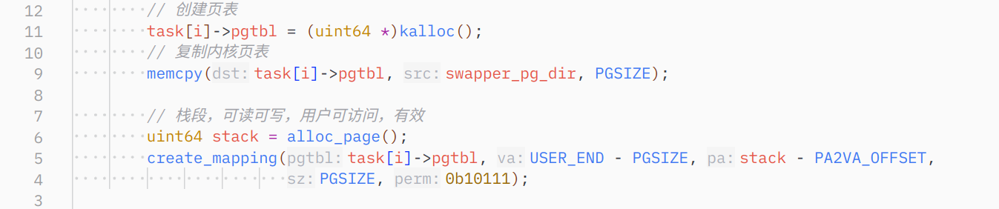
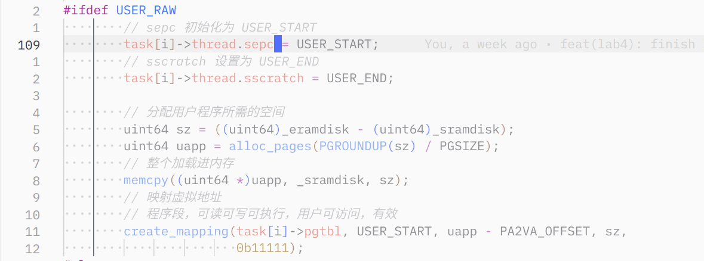
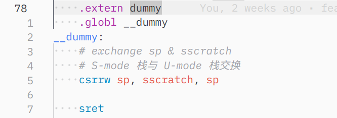
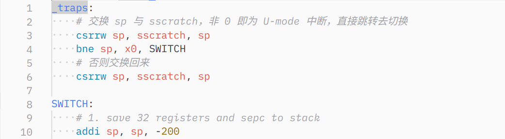
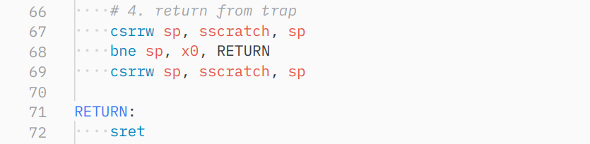
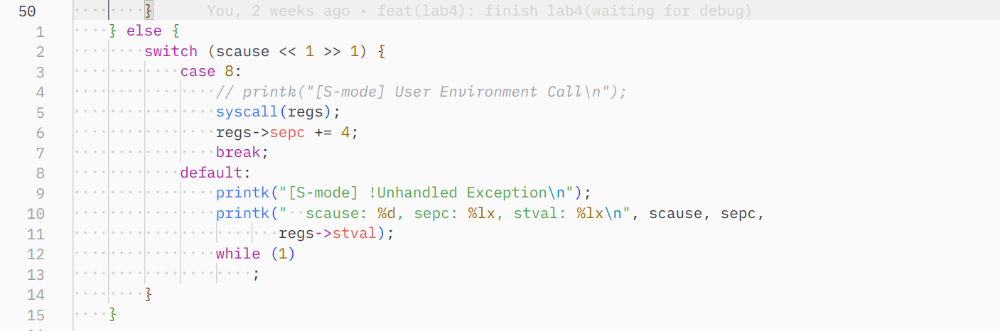
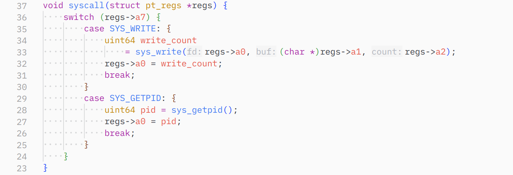
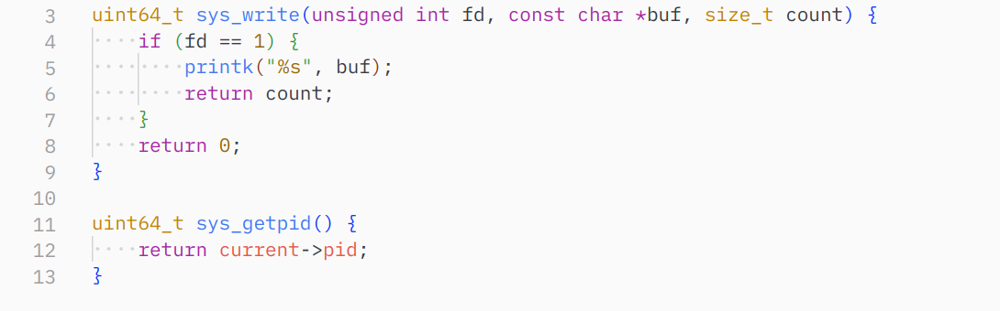
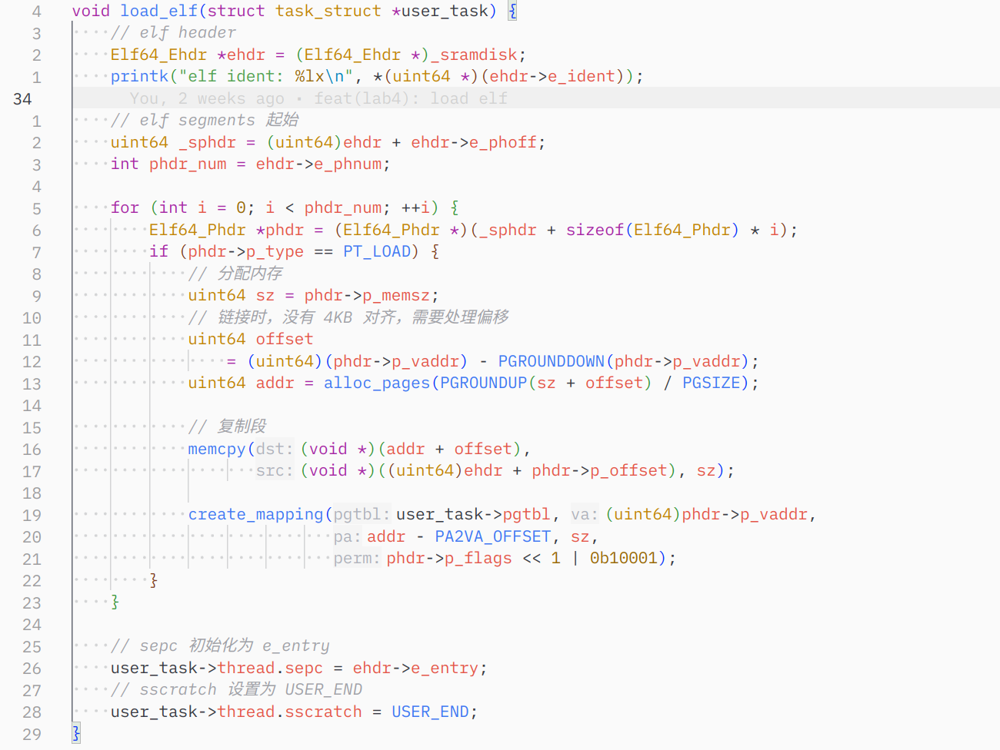
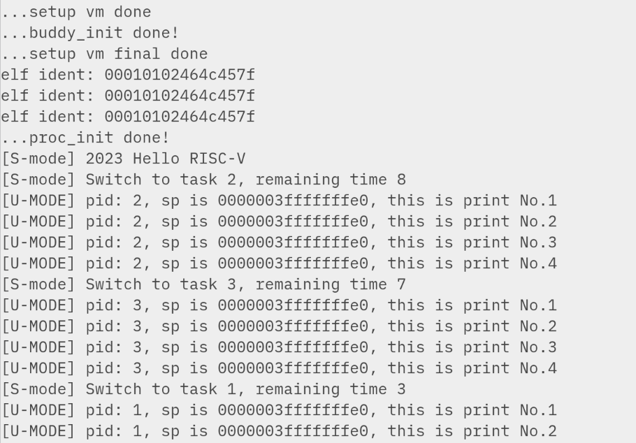

### 修改 task_init

修改初始化进程的过程：

首先创建页表，复制内核页表、创建栈段并映射：

设置 sepc、sscratch，分配空间、加载程序进内存并创建虚拟地址映射：

修改 `_trap` 和 `trap_handler`

`__dummy` 中不再需要指定 sepc（已经在初始化时指定），交换用户栈和内核栈即可

`_trap` 开头和末尾交换：

处理 User ecall：

### 实现 syscall

syscall 处理函数：

两个具体调用实现：

其他修改 head.S、main 函数的过程就不多展示了，没有特别值得一提的地方。

### Elf 支持

同样，和原来加载过程的区别仅在于不同段用不同的权限去加载。整体框架和文档给出的一致：

需要额外解释的是，由于编译 uapp 和 ramdisk 时没有页对齐，因此需要处理偏移；分配时也需要加上头偏移，因为 alloc_pages 从一整页的开头开始分配内存，不加上 offset 可能会导致少分配一页。其他部分按正常流程分配内存、复制、创建映射即可。

### 结果

### 思考题

1. 一对一。一个 thread_struct 对应一个用户线程和内核线程（各一个运行栈）

2. 这是由于 bss 段的存在：bss 段存放*未初始化*的静态变量，由于它们没有初始数据，为了节省空间起见在 ELF 中仅用一个数字代表 size，即这个 section 仅存在于内存中，不存在于 executable 中。`readelf -s` 即可验证。

3. 因为每个进程的页表不同。想知道物理内存需要一级级读页表，如果**内核让用户可读这段内存**或者提供系统调用自然可以知道。当然这不属于“常规方法”。用户内存段和内核内存段说到底也只是 convention，不是硬限制。

   > 实际上我不知道这里的“常规方法”是什么意思。如果想通过读某个 csr 来知道真实地址自然是没有。